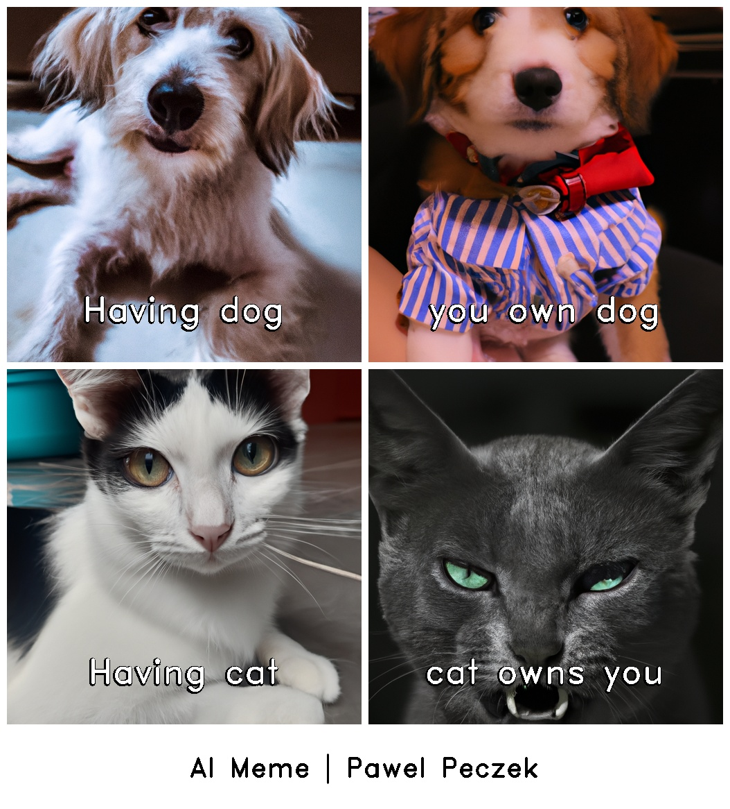

# AIMemesGenerator
This repository host a source code allowing to generate memes by AI.

## How the tool works?
User provides list of image descriptions that will be used to generate meme components using Open AI Dall-E 2.
Along with images description,  user needs to provide texts visible in specific parts of the meme - number of texts
determine number of meme elements (`blank` should be provided if image is intended to be placed without text).
If more texts than images will be provided - then images will be looped as if the list of descriptions was cyclic.
Results will be dumped into pointed directory.

### Example result


## Installation
```bash
pip install git+https://github.com/PawelPeczek/AIMemesGenerator.git
```

## Usage example

### Prerequisites
To use the tool - you must create [OpenAI API](https://openai.com/api/) account and then export API key in environment
variable:
```bash
export OPENAI_API_KEY=<your_api_key>
```

### Command

```bash
ai_memes_generator \
  --title "Cats and dogs" \
  --image-description "cute dog everyone will love" --meme-text "Having dog" \
  --image-description "cute dog everyone will love" --meme-text "you own dog" \
  --image-description "cute cat everyone will love" --meme-text "Having cat" \
  --image-description "evil cat" --meme-text "cat owns you" \
  --columns-number 2 \
  --variants-number 4 \
  --target-directory ./assets
```
